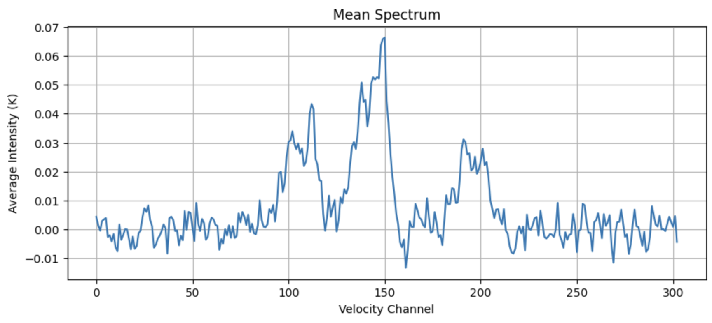

# Fourier Analysis to Find Turbulence in TMC-1 Filament

**By Anna Brandigi**

The HCN data comes from the Undergraduate Project to Map Dense Gas in the Taurus Molecular Cloud, led by Prof. Yancy Shirley. 

## CONTEXT

### The Taurus Molecular Cloud

The goal of this project is to use Fourier Analysis to investigate the distribution of dense gas in a region of the Taurus Molecular Cloud (TMC-1). TMC-1 is primarily composed of molecular hydrogen (H2). However, H2 is a homonuclear diatomic molecule. Its symmetry means that it does not have a permanent dipole moment, making it invisible in radio and submillimeter regimes. The only H2 transitions we could see happen rarely and require temperatures too high to achieve in cold, dense molecular clouds (~10K). 

We must track H2 indirectly using tracer molecules: molecules which exist in the same regions as H2 but are much easier to detect. This dataset used hydrogen cyanide (HCN). HCN’s chemical properties make it a good tracer for dense gas. It forms in cold, dense environments and emits at low temperatures. It has a high dipole moment, and its rotational transitions have high critical densities, so it lights up in dense regions. It also has a low enough freeze-out that doesn’t freeze onto dust grains and stop emitting in our regime like carbon monoxide does. 

### Fourier Analysis

This notebook uses Fourier analysis to examine the distribution of HCN intensity (and therefore gas density) in our TMC-1 map. The Fourier analysis decomposes data into its spatial frequency components. It shows us what patterns appear in the data and how strong those patterns are. A power spectrum is the squared amplitude of the Fourier transform. It shows you how much structure (power) exists at each spatial frequency (k). 

Low spatial frequencies, or low k values, correspond to large-scale structures. In the context of our molecular cloud, they represent things like filaments and cloud-wide flows. High k values correspond to small-scale structures, like dense clumps, shocks, and turbulence. 

A steep negative slope at high k means that the gas is smoother or more dissipative at small scales. A shallower slope at low k implies that there is more power in large-scale structures, indicating the presence of large-scale turbulence or gravitational instabilities. 

## SETUP

This project’s input is a three-dimensional FITS data cube of HCN J=1->0 line emission. The cube shows HCN emission over different velocity channels (first axis) and locations in the sky (second and third axes). Each velocity channel gives a “slice” through the gas moving at a given velocity along the line of sight. The coordinates in the second and third axes are the right ascension and declination. 

## USAGE

1. Place `B10_HCN_map.fits` in the working directory
2. Set `filename` to the name of your fits data cube
3. Run script in a Python environment
4. Set `velocity_range` to the range of velocity channels where emission occurs (where there are peaks in the `Mean Spectrum`)
5. Select a relatively isotropic region of the intensity map for further analysis (`clump_map`)
6. Run the rest of the notebook

### Example Outputs

